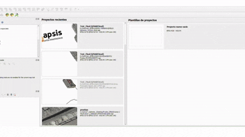
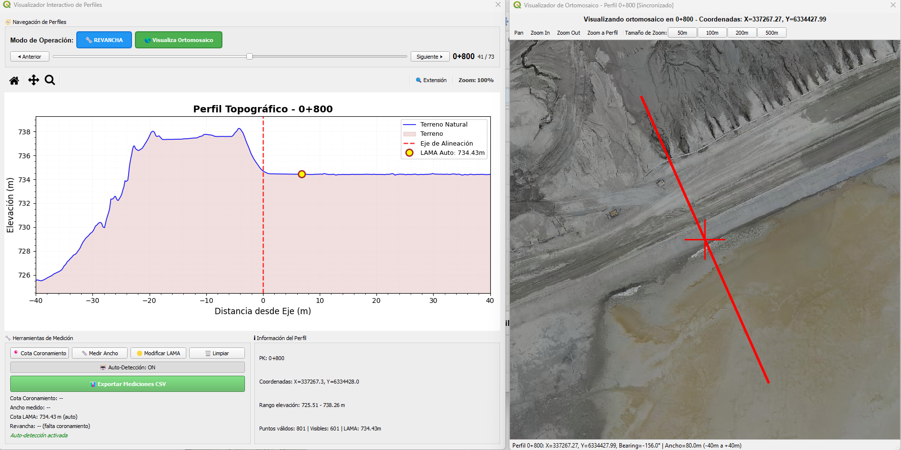

  <h1 style="margin-bottom: 8px;">🏗️ <strong>Revanchas LT Plugin</strong></h1>

  

    Plugin profesional para <strong>QGIS</strong> orientado a análisis topográfico y medición de revanchas en muros de contención.  
    Ofrece sincronización en tiempo real entre el visualizador de perfiles y los ortomosaicos, flujos de trabajo automatizados y reportes listos para entrega.
  

  <figure style="margin: 12px 0 0; max-width:450px;">
    
    <figcaption style="font-size:13px; color:#555; margin-top:8px;">
    </figcaption>
  </figure>

---

## 🚀 Características Principales

### 📈 Análisis de Perfiles Topográficos
- Procesamiento automático de archivos DEM (GeoTIFF)
- Generación de perfiles transversales precisos
- Visualización interactiva con matplotlib
- Navegación por PK con controles intuitivos

### 📐 Herramientas de Medición
- **Coronamiento**: Medición de elevación de corona del muro
- **Ancho de Muro**: Medición horizontal con distancia automática
- **Puntos LAMA**: Detección automática desde archivos CSV
- **Modo Ancho Proyectado**: Visualización inmediata en ambas ventanas

### 🗺️ Visualización de Ortomosaico
- Soporte nativo para archivos ECW
- Navegación sincronizada con perfiles
- Mediciones superpuestas en tiempo real
- Líneas de referencia perpendiculares al eje

### 🎮 Controles Avanzados
- **Detección Automática**: Auto-detección de características del terreno
- **Modos de Operación**: Medición manual y automática
- **Navegación por Teclado**: Controles eficientes con teclas de flecha
- **Zoom Sincronizado**: Coordinación entre visualizadores

  

<h2 align="center">🚀 Eficiencia Operacional por Muro</h2>

<table align="center" style="border-collapse:collapse; font-size:16px;">
  <tr>
    <th style="padding:6px 20px;">Muro</th>
    <th style="padding:6px 20px;">Método</th>
    <th style="padding:6px 20px;">Tiempo por Muro</th>
  </tr>
  <tr>
    <td align="center">🧱 MP - Muro Principal</td>
    <td>CAD Manual</td>
    <td>~1 h</td>
  </tr>
  <tr>
    <td></td>
    <td>Plugin Automatizado</td>
    <td>~15 min</td>
  </tr>
  <tr>
    <td align="center">🧱 MO - Muro Oeste</td>
    <td>CAD Manual</td>
    <td>~30 min</td>
  </tr>
  <tr>
    <td></td>
    <td>Plugin Automatizado</td>
    <td>~5 min</td>
  </tr>
  <tr>
    <td align="center">🧱 ME - Muro Este</td>
    <td>CAD Manual</td>
    <td>~30 min</td>
  </tr>
  <tr>
    <td></td>
    <td>Plugin Automatizado</td>
    <td>~5 min</td>
  </tr>
</table>

<pre align="center" style="font-size:15px; line-height:1.4em; background:#f8f9fa; padding:12px 20px; border-radius:8px; display:inline-block;">
Tiempo total (3 muros)
───────────────────────────────
CAD Manual           ████████████████████████████████████  ~2 h
Plugin Automatizado  ███  ~25 min
</pre>

📊 <strong>Ahorro estimado:</strong> 
🚀 Reducción de <strong>~80%</strong> en tiempo total de procesamiento 
💪 De <strong>2 horas</strong> a solo <strong>25 minutos</strong> con resultados de los 3 muros listos para entrega

## 🤝 Soporte

### **📧 Información de Contacto Linkapsis**

**🏢 Empresa:** Linkapsis  
**👨‍💻 Desarrollador:** Tito Ruiz - Analista de Desarrollo y Procesos  
**📧 Email:** [truizh@linkapsis.com](mailto:truizh@linkapsis.com)
**📧 Email:** [tito.ruiz@usach.cl](mailto:tito.ruiz@usach.cl)  
**🌐 Website:** [www.linkapsis.com](https://www.linkapsis.com)  
**📅 Fecha Desarrollo:** Agosto 2025  

